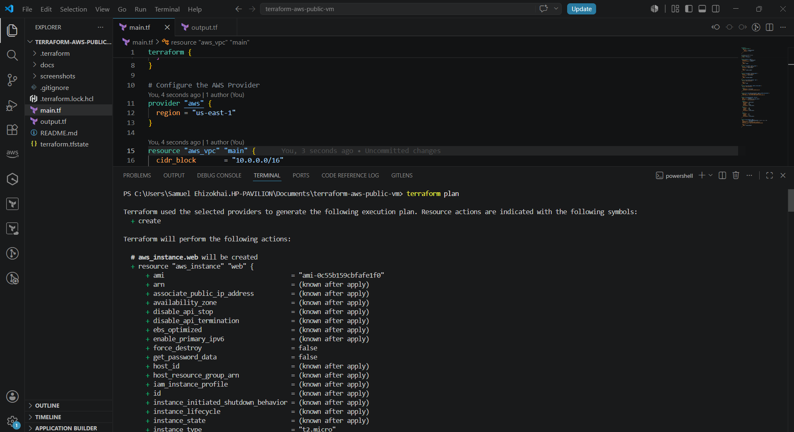
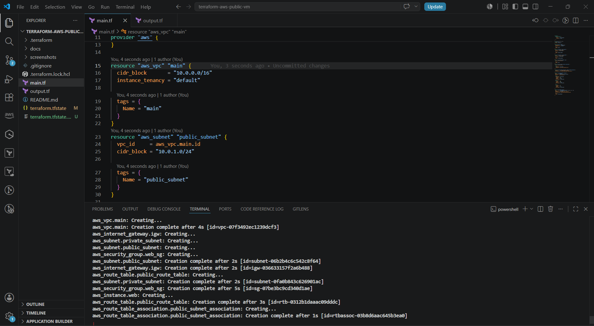
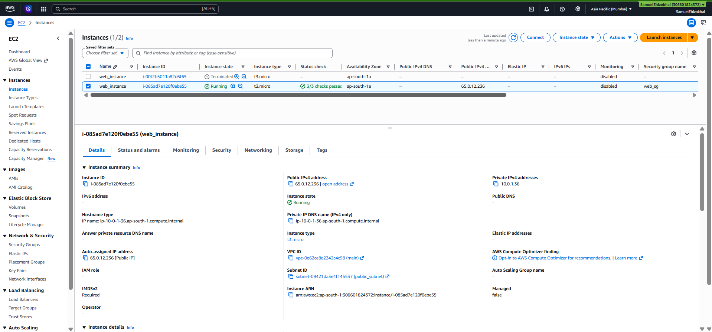
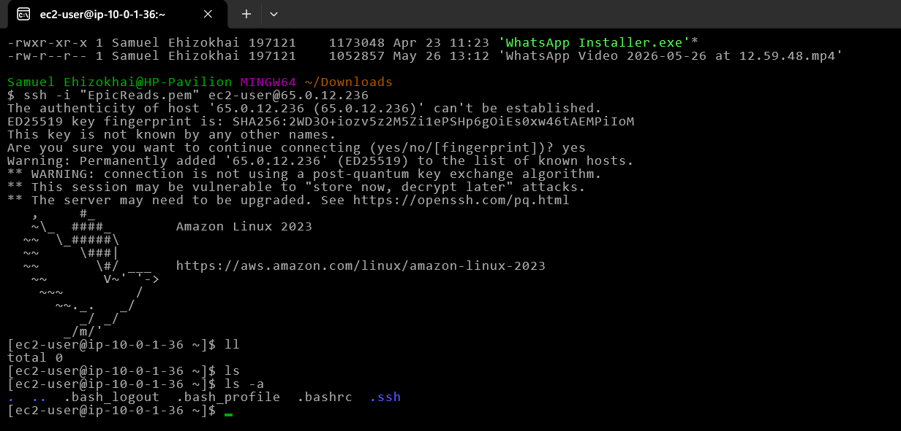

# Terraform AWS VM Deployment (Public Network)

[](https://terraform.io)
[](https://aws.amazon.com)

> Provisioning a publicly accessible EC2 instance on AWS using Terraform — from zero to SSH access, fully automated.

## 📖 Overview

This project uses Terraform to deploy a virtual machine (EC2 instance) on AWS with a public IP address, accessible over SSH. It demonstrates Infrastructure as Code fundamentals: providers, resources, variables, outputs, and state management.

## 🏗️ Architecture


## 🧰 Prerequisites

- AWS account with an IAM user (programmatic access)
- AWS CLI configured (`aws configure`)
- Terraform installed (`terraform -version` to confirm)
- An existing EC2 key pair (or create one via Terraform)

## 📁 Project Structure

| File | Purpose |
|------|---------|
| `main.tf` | Defines the AWS provider and region, VPC, subnet, IGW, route table, security group, EC2 instance |
| `outputs.tf` | Outputs the public IP of instance after apply |

## ⚙️ Resources Created

- 1x VPC
- 1x Public Subnet
- 1x Internet Gateway
- 1x Route Table (with route to IGW) + association
- 1x Security Group (SSH port 22, HTTP port 80 — adjust as needed)
- 1x EC2 Instance (with public IP auto-assigned)

## 🚀 Deployment Steps

### 1. Create Directory
\`\`\`bash
mkdir terraform-aws-public-vm
cd terraform-aws-public-vm
\`\`\`

### 2. Create Main.tf file & Configure your AWS provider
\`\`\`bash
Touch main.tf output.tf
\`\`\`

### 3. Initialize Terraform
\`\`\`bash
terraform init
\`\`\`
This downloads the AWS provider plugin and sets up the backend.

### 4. Review the execution plan
\`\`\`bash
terraform plan
\`\`\`
Confirms exactly what Terraform will create before touching your AWS account.

### 5. Apply the configuration
\`\`\`bash
terraform apply
\`\`\`
Type `yes` when prompted. Terraform provisions the VPC, subnet, security group, and EC2 instance.

### 6. Get the public IP
\`\`\`bash
terraform output web_instance_public_ip
\`\`\`

### 7. SSH into the instance
\`\`\`bash
ssh -i <your-key>.pem ec2-user@<public-ip>
\`\`\`

### 8. Destroy when done (avoid ongoing AWS charges)
\`\`\`bash
terraform destroy
\`\`\`

## 🖼️ Screenshots

| Step | Screenshot |
|------|-----------|
| `terraform plan` output |  |
| `terraform apply` success |  |
| EC2 instance in AWS Console |  |
| SSH connection successful |  |

## 🔐 Security Notes

- Security group restricts SSH (port 22) to [your IP / 0.0.0.0 for demo — note the tradeoff]
- No hardcoded credentials — AWS credentials sourced from AWS CLI config / environment variables
- `.tfvars` and `.tfstate` excluded from version control via `.gitignore`

## 🐛 Issues Encountered & Solutions

### Issue 1 — Invalid/outdated AMI ID
**Error:**
```
InvalidAMIID.NotFound: The image id 'ami-0c55b159cbfafe1f0' does not exist
```
**Cause:** The AMI ID was hardcoded and referenced an Amazon Linux 2 image that no longer exists in `ap-south-1` — AMI IDs are region-specific and get deprecated/replaced over time.

**Fix:** Replaced the hardcoded ID with a Terraform data source that always resolves to the latest valid AMI at apply time:
```hcl
data "aws_ami" "amazon_linux" {
  most_recent = true
  owners      = ["amazon"]

  filter {
    name   = "name"
    values = ["al2023-ami-*-x86_64"]
  }

  filter {
    name   = "virtualization-type"
    values = ["hvm"]
  }
}
```
Then referenced it in the instance block as `ami = data.aws_ami.amazon_linux.id` instead of a static string.

---

### Issue 2 — `groupName` cannot be used with `subnet`
**Error:**
```
InvalidParameterCombination: The parameter groupName cannot be used with the parameter subnet
```
**Cause:** The EC2 instance was referencing the security group using the legacy `security_groups` argument (which expects a security group **name**, EC2-Classic style). AWS doesn't allow name-based security group references once a `subnet_id` is set, since subnets only exist inside a VPC, and VPC-based instances require ID-based references.

**Fix:** Changed the argument from `security_groups` to `vpc_security_group_ids`, referencing the security group by ID instead of name:
```hcl
# Before
security_groups = [aws_security_group.web_sg.name]

# After
vpc_security_group_ids = [aws_security_group.web_sg.id]
```

---

### Issue 3 — Key pair not found
**Error:**
```
InvalidKeyPair.NotFound: The key pair 'EpicReads.pem' does not exist
```
**Cause:** The `key_name` argument included the `.pem` file extension. AWS key pair *names* never include `.pem` — that extension only applies to the private key file downloaded to your machine, not the key pair name registered with AWS.

**Fix:** Removed the `.pem` extension from the `key_name` value so it matched the actual registered key pair name in AWS:
```hcl
# Before
key_name = "EpicReads.pem"

# After
key_name = "EpicReads"
```

---

### Issue 4 — Empty public IP output
**Error:** `terraform output public_ip` returned `""` — no error message, just a blank value.

**Cause:** The public subnet did not have `map_public_ip_on_launch = true` set, so instances launched into it weren't automatically assigned a public IP — even though the subnet had a valid route to the Internet Gateway.

**Fix:** Rather than relying on auto-assigned public IPs (which also change on stop/start), attached a dedicated Elastic IP to the instance for a stable, guaranteed address:
```hcl
resource "aws_eip" "web_eip" {
  instance = aws_instance.web.id
  domain   = "vpc"
}

output "public_ip" {
  value = aws_eip.web_eip.public_ip
}
```

---

### Issue 5 — Terraform state files at risk of being committed
**Problem:** `terraform.tfstate` and `terraform.tfstate.backup` track the real, live details of the AWS account (resource IDs, IPs, configuration) and were sitting in the project folder alongside version-controlled files.

**Fix:** Added a `.gitignore` before the first commit to exclude Terraform state and secrets from version control:
```gitignore
.terraform/
*.tfstate
*.tfstate.backup
*.tfvars
```
Verified nothing sensitive had already been tracked with `git status` and `git log --all --full-history -- terraform.tfstate` before pushing.

---

## 📚 What I Learned

**Terraform data sources over hardcoded values**
AMI IDs, and infrastructure identifiers in general, shouldn't be hardcoded — they go stale. Using `data` blocks to look up current values at apply time makes the configuration resilient to AWS changing things behind the scenes.

**VPC-based EC2 instances require ID-based security group references**
`security_groups` (by name) is a legacy EC2-Classic argument. Any instance launched into a VPC subnet must use `vpc_security_group_ids` (by ID). Mixing the two, or using the wrong one, throws a parameter combination error that doesn't always make the actual cause obvious from the message alone.

**Key pair *names* and key *files* are two different things**
The `.pem` extension belongs to the downloaded private key file on your machine — it is never part of the key pair name registered with AWS. This is an easy copy-paste mistake when moving from a filename to a Terraform variable.

**Auto-assigned public IPs are not persistent**
A subnet's `map_public_ip_on_launch` setting only affects new instances launched after the setting is applied — it doesn't retroactively add a public IP to an already-running instance. For a stable address that survives stop/start cycles, an Elastic IP is the more reliable choice.

**State files are sensitive and must never be committed**
`terraform.tfstate` is effectively a live snapshot of real infrastructure — resource IDs, IPs, and configuration details. A `.gitignore` needs to be in place *before* the first commit, not after, since removing a file from tracking later doesn't erase it from git history.

**Error messages point to symptoms, not always root causes**
Several of these errors (`InvalidParameterCombination`, `InvalidKeyPair.NotFound`) described the immediate technical conflict but required tracing back through the actual resource block to find the real mismatch — reinforcing that debugging infrastructure is less about memorizing fixes and more about understanding how each resource argument maps to a real AWS concept.

## 🔮 Next Steps / Improvements

- [ ] Parameterize into a reusable Terraform module
- [ ] Add remote state backend (S3 + DynamoDB locking)
- [ ] Add user_data script for automatic software install on boot
- [ ] Convert to multi-environment setup using Terraform workspaces

## 👤 Author

**[Samuel Ehizokhai]** — DevOps/Cloud Engineer  
[Linkedin][www.linkedin.com/in/samuel-ehizokhai] · [Github][https://github.com/ehizokhaisamuel-netizen] · [Email][ehizokhaisamuel@gmail.com]
